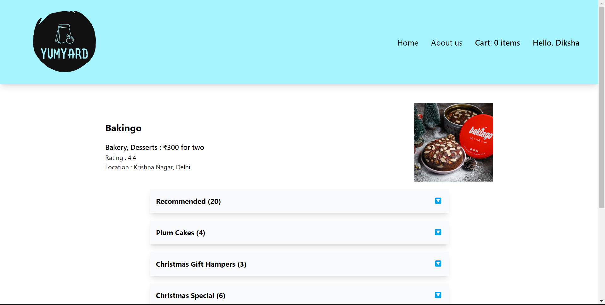

# YumYard

(Tech stacks : React.js + Parcel + TailwindCSS + Redux Toolkit)

- Created a food ordering app with a config driven UI and fetched data from realtime API of Swiggy.

- Implemented React Router with children routes and dynamic routing to display menus for restaurants.

- Built the functionality of Cart using Redux Toolkit.

- Reduced website load time with lazy loading.

- Implemented React Context to display name of the user globally.

- Developed Custom Hook to check the online status of user.

- Modular and performant code.
